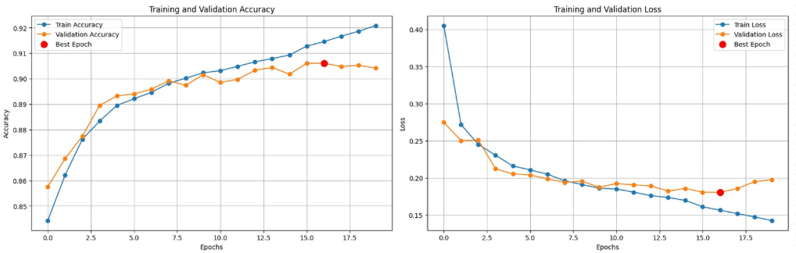
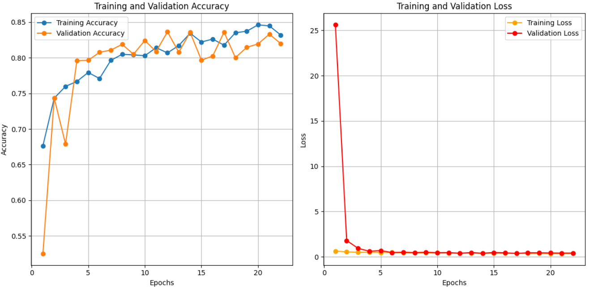
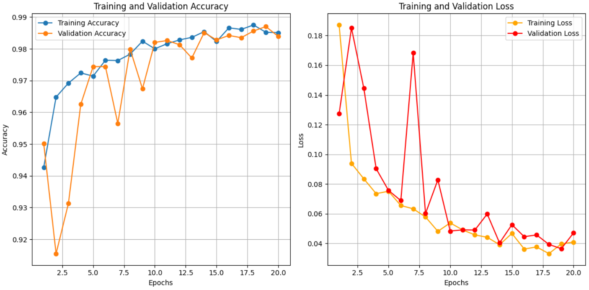
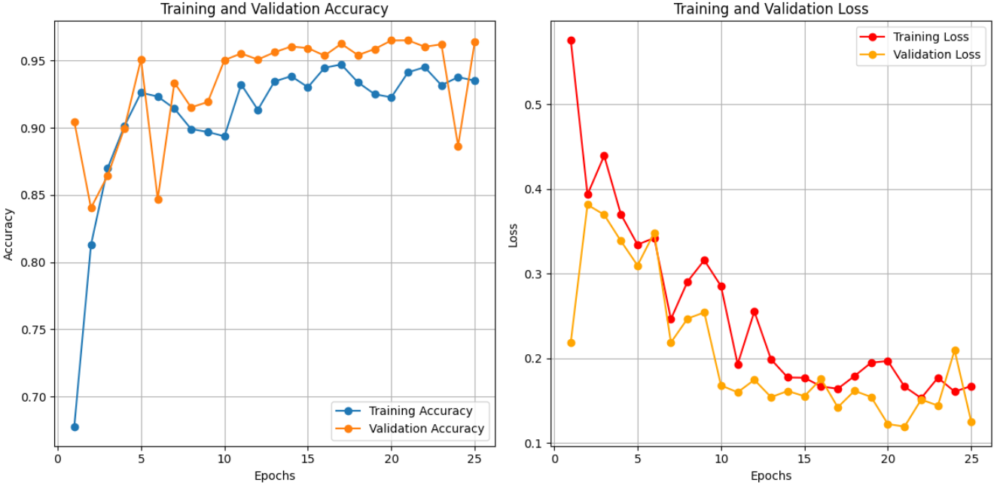

# Nirman_Netra_Models

**Nirman Netra** is an AI-powered monitoring platform for detecting unauthorized constructions using aerial imagery. This repository focuses on the **deep learning model development** aspect of the project. It includes:

* A **building detection model** that identifies structures from high-resolution drone or satellite imagery.
* A **waterbody detection model** to detect lakes, rivers, or ponds near constructions.
* A **change detection model** to flag newly constructed areas over time by comparing temporal aerial images.

All models were trained on `.tif` format images containing geo-metadata, enabling further geospatial analysis such as:

* Estimating **building dimensions**
* Measuring **proximity to waterbodies**
* Resolving **geographic addresses**
* Flagging **unauthorized buildings** by integrating with regulation data and assumed government databases.

This repository contains only the model development notebooks and sample outputs. The full application (frontend + backend) is maintained in a separate repository.

---

## 🗂️ Project Structure

```bash
Nirman_Netra_Models/
├── notebooks/
│   ├── building_segmentation.ipynb     # Building segmentation model training & inference
│   ├── change_detection.ipynb       # Change detection model using temporal imagery
│   ├── waterbody_segmentation.ipynb    # Waterbody segmentation model training & inference
├── sample_outputs/
│   ├── building_predictions.png
│   ├── change_map_example.png
│   └── waterbody_overlay.png
├── epoch_details/
│   ├── building_spacenet_training.png
│   ├── building_custom_training.png
│   ├── change_detection_training.png
│   └── waterbody_training.png
├── README.md                        # Project documentation
├── requirements.txt                 # Python dependencies (optional)
```

---

## How to Run

> These notebooks are designed to be run on a Python environment (recommended: Python 3.10), preferably with GPU support for faster training/inference.

1. **Clone the repository**:

   ```bash
   git clone https://github.com/Janesh-e/Nirman_Netra_Models.git
   cd Nirman_Netra_Models
   ```

2. **Install dependencies**:

   ```bash
   pip install -r requirements.txt
   ```

3. **Open and run notebooks**:

   * `building_detection.ipynb`: Trains and tests a model to detect buildings from aerial imagery.
   * `change_detection.ipynb`: Compares two georeferenced images to identify changed areas.
   * `waterbody_detection.ipynb`: Detects waterbodies in aerial views to assess environmental impact.

> All notebooks include inline documentation and examples using sample `.tif` files (with embedded geo-metadata).

---

## Models Used

All models used in this project are based on the **U-Net architecture**, a widely adopted convolutional network for semantic segmentation. Each model was tailored to its specific task, with variations in input shape, depth, and number of filters to balance performance and efficiency.

### 🔹 1. Building Detection Model

* **Architecture**: Optimized U-Net
* **Input Shape**: `(640, 640, 3)`
* **Task**: Binary segmentation to identify building footprints in aerial imagery.
* **Characteristics**:
  * Lightweight encoder-decoder design with gradual feature scaling (16 → 256 filters).
  * Batch Normalization and Dropout regularization for better generalization.
  * Output: Binary mask highlighting building regions.
* **Loss**: Binary Cross-Entropy

> Designed for faster inference on high-resolution satellite/drone `.tif` images while maintaining decent precision.

### 🔹 2. Change Detection Model

* **Architecture**: Deep U-Net with higher capacity
* **Input Shape**: `(512, 512, 6)` — stacked pair of pre-change and post-change RGB images
* **Task**: Segment areas that have undergone changes (e.g., new constructions)
* **Characteristics**:
  * Deeper network with a larger bottleneck (up to 512 filters)
  * Takes concatenated temporal image pairs as input
  * Useful for flagging regions to be further analyzed for new or unauthorized structures

> This model helps automatically narrow down areas of interest by comparing different timestamps of the same location.

### 🔹 3. Waterbody Detection Model

* **Architecture**: Classic U-Net with wide layers
* **Input Shape**: `(640, 640, 3)`
* **Task**: Semantic segmentation of waterbodies such as lakes, rivers, or ponds.
* **Characteristics**:
  * Higher parameter count with up to 1024 filters at the bottleneck
  * Accurate delineation of water edges and proximity regions
  * Essential for proximity analysis during environmental rule checks

> This model ensures accurate assessment of construction legality near waterbodies.

Each model was trained and validated independently with task-specific data preprocessing and augmentation. You can find the corresponding training code and sample predictions in the `notebooks/` folder.

---

## 📦 Datasets

To train and evaluate the deep learning models in **Nirman Netra**, we used a combination of publicly available datasets and self-annotated imagery. Below are the dataset details per task:

### 1. Change Detection – **LEVIR-CD**

* **Source**: [LEVIR-CD Dataset](https://justchenhao.github.io/LEVIR/)
* **Content**: Paired high-resolution aerial images (pre-change and post-change) of urban areas taken at two different times, along with change masks.
* **Usage**: Used to train the **change detection model** to identify areas that underwent construction or other significant alterations.

### 2. Building Detection – **SpaceNet (Rio) + Self-Annotated Data**

* **Sources**:
  * [SpaceNet Building Detection Dataset – Rio de Janeiro](https://spacenet.ai/spacenet-buildings-dataset-v2/)
  * Custom-annotated screenshots from **Google Earth**
* **Usage**: Used to train the **building segmentation model** for detecting building footprints from aerial imagery.

* **Note**: We initially tried creating a custom dataset by annotating Google Earth screenshots. However, due to limited time, limited quantity, and inconsistent quality, they were used sparingly.

### 3. Waterbody Detection – SpaceNet (Mumbai) + Self-Annotated

* **Source**: Combination of:
  * SpaceNet’s Mumbai region satellite images
  * Custom screenshots from Google Earth
* **Annotation**: Manually labeled to create waterbody masks (lakes, ponds, rivers).
* **Usage**: Used to train a binary segmentation model for identifying waterbodies.

> All datasets were available in the `.tif` format with preserved geo-metadata for downstream spatial analysis such as dimension extraction and location mapping.

---

## 📊 Training Details

Each model was trained independently using task-specific datasets and hyperparameters. The training process was monitored using validation accuracy and loss to prevent overfitting and ensure generalization.

Training and validation performance graphs for all models are shown below:

### Building Detection – SpaceNet (Rio)



### Building Detection – Self-Annotated (from Google Earth)



### Change Detection – LEVIR-CD



### Waterbody Detection – SpaceNet (Mumbai) + Google Earth



---

## 📈 Evaluation Metrics

The table below summarizes key evaluation metrics for each model:

| Model                         |  Accuracy |  Loss    |  Val Accuracy |  Val Loss |
| ----------------------------- | --------- | -------- | ------------- | --------- |
| Building Detection (SpaceNet) | `0.9128`  | `0.1613` | `0.9061`      | `0.1809`  |
| Building Detection (Custom)   | `0.8177`  | `0.3996` | `0.8361`      | `0.3665`  |
| Change Detection (LEVIR-CD)   | `0.9852`  | `0.0396` | `0.9870`      | `0.0364`  |
| Waterbody Detection           | `0.9351`  | `0.1674` | `0.9640`      | `0.1250`  |

---

## 🤝 Acknowledgements

We'd like to acknowledge the following resources and frameworks:

* TensorFlow & Keras for model development
* OpenCV, Rasterio and GeoPy for image and geo-data processing
* Publicly available datasets for aerial imagery
* Team Nirman Netra for end-to-end development of the system

---
